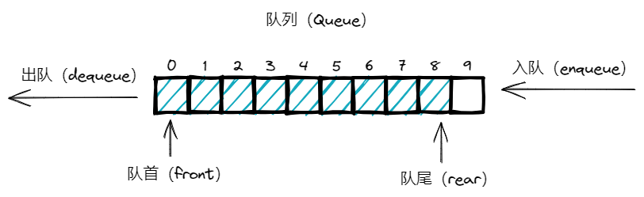
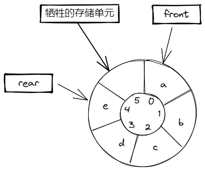

# 针对如何区分循环队列的队空和队满问题的不同解决方案分析与实现


## 1 队列

### 1.1 队列的定义

> **队列**是一种只能在一端插入（队尾），在另一端删除（队首）的有序线性表。队列中的第一个插入的元素也是第一个被删除的元素。所以，队列是一种`先进先出（FIFO，First In First Out）`或`后进后出（LILO，Last In Last Out）`线性表。
>
> ———— 《数据结构与算法经典问题解析：Java语言描述》5.1



图1 一个基于数组实现的队列的存储结构示意图

### 1.2 队列抽象数据类型

> 队列的基本操作是enqueue（入队），它是在表的末端（叫做队尾（rear））插入一个元素和dequeue（出队），它是删除（并返回）在表的开头（叫做队头（front））的元素。
>
> —————— 《数据结构与算法分析：Java语言实现（原书第3版）》3.7

下面给出队列抽象数据类型中的基本操作。为了简单起见，假设元素都是整数。

#### 1.2.1 主要的队列操作

* enqueue(int data)：在队列的队尾插入一个元素
* int dequeue()：删除并返回队首的元素

#### 1.2.2 辅助的队列操作

* boolean isEmpty()：判断队列是否存储了元素
* int size()：返回队列中存储的元素个数
* int showHeadQueue()：返回队列的队首元素，并不删除


## 2 队列的存储结构

一般而言，线性表有顺序存储和链式存储，而队列作为一种特殊的线性表，因此也有两种实现方式，基于顺序存储结构实现的队列结构称为`顺序队列`，基于链式存储结构实现的队列结构称为`链式队列`。`顺序队列`通常基于数组实现，`链式队列`通常基于链表实现。以下仅介绍顺序队列的情况，链式队列暂不讨论。

### 2.1 顺序队列

基于顺序存储结构的性质，顺序队列需要包含以下

- 顺序队列的长度，即队长 （`MAX_SIZE`）
- `front` 指针始终指向队头元素
- `rear` 指针始终指向队尾有效元素的下一个位置

一般有固定长度的顺序队列，称为静态顺序队列，而有不定长度的顺序队列称为动态顺序队列。

### 2.2 循环队列

循环队列是把顺序队列首尾相连，把存储队列元素的表从逻辑上看成一个环，成为循环队列。因为`链式队列`不会考虑存储空间和溢出的问题，所以一般循环队列默认是`顺序队列`。基于此，下文中提到循环队列默认为对顺序循环队列的讨论。


/Tencent/history/1491450333/FileRecv/%E9%98%9F%E5%88%97%20-%20%E5%BE%AA%E7%8E%AF%E9%98%9F%E5%88%97/.asserts/%E5%BE%AA%E7%8E%AF%E9%98%9F%E5%88%97%20-%20%E7%A9%BA%E9%98%9F.png)

图2 一个循环队列：空队

### 2.3 队列存储结构的实现方法

* 基于链表的实现方法
* 基于简单数组的实现方法
  1. 基于简单循环数组的实现方法
  2. 基于动态循环数组的实现方法


## 3 循环队列的产生背景以及简单实现介绍

### 3.1 顺序队列的一些问题

#### 3.1.1 “假溢出”现象

由队列的定义可知，队列是一种FIFO线性表，只能在队列一端执行插入操作，而在另一端执行删除操作，在顺序队列中，随着队列元素不断的插入和删除，队尾指针会逐渐右移，当队尾指针 `rear = MAX_SIZE -1` ，在下一次的元素插入队列操作时，会发现队列空间已满，无法执行入队操作，很容易发现，由于之前的删除操作，队列的前端空间是已被释放出来的，这就是“假溢出”现象。

#### 3.1.2 出队的时间复杂度

顺序队列中元素出队，后面的元素都要往前挪动一个位置，这是一个O(n)操作。而循环队列中的元素出队操作，只需要将head的指向改变一个位置就好了，这是一个O(1)操作。

#### 3.1.3 空间利用率

对于长度一定的数组，存储的空间是确认的，在队列的入队和出队的过程中，数组中的存储空间需要不断的重复使用，那么这里的“不断重复使用”，就需要循环来实现，否则会出现空间的浪费。

### 3.2 基于循环数组的简单实现

> 简单的解决方法，只要front或rear到达数组的尾端，它就又绕回开头。这就叫做循环数组实现。

基于以上分析的顺序队列在一些场景下的缺陷以及不足，一般采用基于循环数组实现循环队列。

在数组中，采用循环增加元素的方式，并使用两个变量分别记录队首元素和队尾元素，通常，使用front变量和rear变量分别表示队列中的队首元素和队尾元素。

## 4 循环队列的队空和队满判断问题的解决方案探索

针对顺序队列在一些场景下的各种缺点，为此使用了循环队列，解决了“假溢出”现象、降低了出队的时间复杂度以及提高了队列的空间利用率，但是，循环队列新的问题出现了，在一般的顺序队列中，判断队满和队空，基于 `front == rear`，即 `队首指针 等于 队尾指针` 的时候，我们可以判断队列为队空，在 `rear == (MAX_SIZE - 1)` 的时候，即 `队尾指针 等于 队长` ，我们可以判断队列为队满，但是由于循环队列的特殊性，当 `队首指针 = 队尾指针` 的时候，既可能表示空也可能表示满，所以需要探索出在循环队列中如何判断队空和队满问题的解决方案。

基于上述对循环队列队空和队满的讨论，结合相关文献发现了我整合了以下一些解决方案以及实现方式以供参考。

现有可能的解决方案但不局限于此：

* 预存长度法
* 预留一位法
* 设标志位法
* 记录元素队列出入次数

### 4.1 预存长法

这是最简单的一种判断方法。

增加一个计数变量count，表示队列中实际存在的数据元素的个数，入队成功时对count 加1，出队成功时队count减1，每次入队出队比较count与队长来判断循环队列的队满队空状态。

#### 4.1.1 算法思路

* 初始化 `count = 0`，`MAX_SIZE` 为队列最大容量
* 出队时，当 `count == 0` ,队空，不能出队，然后 `count--`
* 入队时，当 `count == MAX_SIZE` ,队满，不能入队，然后 `count++`

#### 4.1.2 相应操作算法

```java
/**
 * 循环队列的队空队满：预存长法
 */
public class CircularQueue {
    /**
     * 循环队列长度
     */
    private final int MAX_SIZE;
    /**
     * 队首指针
     */
    private int front;
    /**
     * 队尾指针
     */
    private int rear;
    /**
     * 基于数组实现的队列
     */
    private final int[] arr;

    /**
     * 已入队的元素个数
     */
    private int count;

    /**
     * 构造一个固定长度的静态顺序队列
     */
    public CircularQueue(int maxSize) {
        MAX_SIZE = maxSize;
        arr = new int[MAX_SIZE];
        front = 0;
        rear = 0;
        count = 0;
    }

    /**
     * 判断队满
     */
    public boolean isFull() {
        return count == MAX_SIZE;
    }

    /**
     * 判断队空
     */
    public boolean isEmpty() {
        return count == 0;
    }

    /**
     * 入队
     */
    public void enqueue(int n) {
        //判断队列满
        if (isFull()) {
            throw new RuntimeException("队列满，不能入队");
        }
        arr[rear] = n;
        rear = (rear + 1) % MAX_SIZE;
        count++;
    }

    /**
     * 出队
     */
    public int dequeue() {
        if (isEmpty()) {
            // 抛出异常
            throw new RuntimeException("队列为空,不能出队");
        }
        // front 指向队列的第一个元素
        // front 后移
        int value = arr[front];
        front = (front + 1) % MAX_SIZE;
        count--;
        return value;

    }

    /**
     * 显式队首
     */
    public int headQueue() {
        if (isEmpty()) {
            throw new RuntimeException("队列为空,不能查看头数据");
        }
        return arr[front];
    }

}
```


### 4.2 预留一位法

在大部分教材中或者一些介绍循环队列问题都会提到的一种方法。



图3 预留一位法：队列队满存储结构示意图

#### 4.2.1 算法思路

约定牺牲存储空间中的一个存储单元来区分。

* 实际容量 `CURRENT_SIZE = MAX_SIZE-1` ,已约定一个存储单元不可用
* 出队时，当 `rear == front` ,队空，不能出队
* 入队时，当`（rear+1）% MAX_SIZE == front` ，队满，不能入队 

#### 4.2.2 相应操作算法

```java
/**
 * 循环队列的队空队满：预留一位法
 */
public class CircularQueue {
    /**
     * 循环队列长度
     */
    private final int MAX_SIZE;
    /**
     * 队首指针
     */
    private int front;
    /**
     * 队尾指针
     */
    private int rear;
    /**
     * 基于数组实现的队列
     */
    private final int[] arr;

    /**
     * 构造一个固定长度的静态顺序队列
     */
    public CircularQueue(int maxSize) {
        MAX_SIZE = maxSize;
        arr = new int[MAX_SIZE];
        front = 0;
        rear = 0;
    }

    /**
     * 判断队满
     */
    public boolean isFull() {
        return (rear + 1) % MAX_SIZE == front;
    }

    /**
     * 判断队空
     */
    public boolean isEmpty() {
        return front == rear;
    }

    /**
     * 入队
     */
    public void enqueue(int n) {
        //判断队列满
        if (isFull()) {
            throw new RuntimeException("队列满，不能入队");
        }
        arr[rear] = n;
        rear = (rear + 1) % MAX_SIZE;
    }

    /**
     * 出队
     */
    public int dequeue() {
        if (isEmpty()) {
            // 抛出异常
            throw new RuntimeException("队列为空,不能出队");
        }
        // front 指向队列的第一个元素
        // front 后移
        int value = arr[front];
        front = (front + 1) % MAX_SIZE;
        return value;

    }

    /**
     * 显式队首
     */
    public int headQueue() {
        if (isEmpty()) {
            throw new RuntimeException("队列为空,不能查看头数据");
        }
        return arr[front];
    }

}
```


### 4.3 设标志位法

这个算法与预存长法差不多，通过一个额外变量来辅助队首与队尾指针的判断，从而判断队空与队满。

增加一个布尔变量 `tag` 来区分，每当入队成功，`tag=true` ；出队成功，`tag=false` 。那么当 `front == rear` 且 tag == true，表示是入队操作造成的 `front == rear`，则队满；如果 `tag == false` 且 `front == rear` ，则表示是出队操作造成的 `front == rear`，则队空 。

#### 4.3.1 算法思路

* 预设 `tag` ，初试 `tag = true`
* 入队时，当 `front == rear && tag` ，队满，不能入队，否则可以入队，并设置 `tag = true`
* 出队时，当 `front == rear && !tag` ，队空，不能出队，否则可以出队，并设置 `tag = false`

#### 4.3.2 相应操作算法

```java
/**
 * 循环队列的队空队满：设标志位法
 */
public class CircularQueue {
    /**
     * 循环队列长度
     */
    private final int MAX_SIZE;
    /**
     * 队首指针
     */
    private int front;
    /**
     * 队尾指针
     */
    private int rear;
    /**
     * 基于数组实现的队列
     */
    private final int[] arr;

    /**
     * 入队成功：true 出队成功：false
     */
    private boolean tag;

    /**
     * 构造一个固定长度的静态顺序队列
     */
    public CircularQueue(int maxSize) {
        MAX_SIZE = maxSize;
        arr = new int[MAX_SIZE];
        front = 0;
        rear = 0;
        // 预设tag = true
        tag = true;
    }

    /**
     * 判断队满
     */
    public boolean isFull() {
        return front == rear && tag;
    }

    /**
     * 判断队空
     */
    public boolean isEmpty() {
        return front == rear && !tag;
    }

    /**
     * 入队
     */
    public void enqueue(int n) {
        //判断队列满
        if (isFull()) {
            throw new RuntimeException("队列满，不能入队");
        }
        arr[rear] = n;
        rear = (rear + 1) % MAX_SIZE;
    }

    /**
     * 出队
     */
    public int dequeue() {
        if (isEmpty()) {
            // 抛出异常
            throw new RuntimeException("队列为空,不能出队");
        }
        // front 指向队列的第一个元素
        // front 后移
        int value = arr[front];
        front = (front + 1) % MAX_SIZE;
        return value;

    }

    /**
     * 显式队首
     */
    public int headQueue() {
        if (isEmpty()) {
            throw new RuntimeException("队列为空,不能查看头数据");
        }
        return arr[front];
    }

}
```


### 4.4 记录元素队列出入次数

这个算法是预存长法的一个变种，思路大致一样，通过分别记录入队次数和出队次数。

增加两个全局变量 A，B，分别表示所有元素入队的次数 A 和元素出队的次数 B,根据 AB 的比较来判断队满与队空

#### 4.4.1 算法思路

* 初始化 `A = 0` , `B = 0` 
* 出队时，当 `front == rear && A == B` ,队空，不能出队，否则 `B++`
* 入队时，当 `front == rear && ((A-B) == MAXSIZE)` ，队满，不能入队，否则 `A++`

#### 4.4.2 相应操作算法

```java
/**
 * 循环队列的队空队满：预存长法2：分别记录入队出队次数法
 */
public class CircularQueue {
    /**
     * 循环队列长度
     */
    private final int MAX_SIZE;
    /**
     * 队首指针
     */
    private int front;
    /**
     * 队尾指针
     */
    private int rear;
    /**
     * 基于数组实现的队列
     */
    private final int[] arr;


    /**
     * 入队次数
     */
    private int enqueueCount;
    /**
     * 出队次数
     */
    private int dequeueCount;

    /**
     * 构造一个固定长度的静态顺序队列
     */
    public CircularQueue(int maxSize) {
        MAX_SIZE = maxSize;
        arr = new int[MAX_SIZE];
        front = 0;
        rear = 0;
        enqueueCount = 0;
        dequeueCount = 0;
    }

    /**
     * 判断队满
     */
    public boolean isFull() {
        return front == rear && (enqueueCount - dequeueCount) == MAX_SIZE;
    }

    /**
     * 判断队空
     */
    public boolean isEmpty() {
        return front == rear && enqueueCount == dequeueCount;
    }

    /**
     * 入队
     */
    public void enqueue(int n) {
        //判断队列满
        if (isFull()) {
            throw new RuntimeException("队列满，不能入队");
        }
        arr[rear] = n;
        rear = (rear + 1) % MAX_SIZE;
        enqueueCount++;
    }

    /**
     * 出队
     */
    public int dequeue() {
        if (isEmpty()) {
            // 抛出异常
            throw new RuntimeException("队列为空,不能出队");
        }
        // front 指向队列的第一个元素
        // front 后移
        int value = arr[front];
        front = (front + 1) % MAX_SIZE;
        dequeueCount++;
        return value;

    }

    /**
     * 显式队首
     */
    public int headQueue() {
        if (isEmpty()) {
            throw new RuntimeException("队列为空,不能查看头数据");
        }
        return arr[front];
    }

}
```

## 5 参考文献

* 数据结构与算法经典问题解析：Java语言描述（原书第2版）/(印)纳拉辛哈·卡鲁曼希 机械工业出版社
* 数据结构与算法图解 / （美）杰伊·温格罗 人民邮电出版社
* 数据结构与算法分析：Java语言描述（原书第3版） （美）维斯 机械工业出版社

