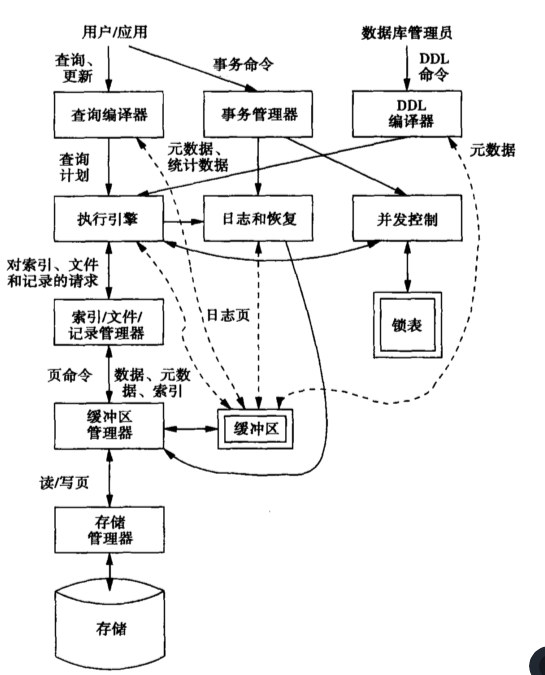

前言

> 数据库系统的出现使信息系统从以加工数据的程序为中心转向围绕共享的数据库为中心的新阶段。这样即便于数据的集中管理，又能简化应用程序的研制和维护，提高了数据的利用率和相容性，提高了决策的可靠性。
>
> 目前，数据库已经称为现代信息系统的重要组成部分。具有数百G、数百T、甚至数百P字节的数据库已经普遍存在于科学技术、工业、农业、商业、服务业和政务部门的信息系统中。

# 1 概述

## 1.1 现实应用案例

> 数据库对于当今的任何部门都是至关重要的。无论何时访问一个主要的网站或者数以千计的提供信息的小网站，总有一个数据库在幕后服务，提供你所需要的信息。
>
> 《数据库系统实现》DBMS系统概述

银行业  -  银行储蓄账户管理系统 -  管理客户信息、账户活动、付款、存款、贷款

运输业 - 火车票预订系统（比如12306）- 预订、支付、日程安排等信息

金融 - 用于存储有关股票和债券等金融工具的股票、销售和购买的信息

论述数据库的必要性

## 1.2 数据库的定义

> 严格地讲，数据库是长期储存在计算机内、有组织地、可共享的大量数据的集合。数据库中的数据按一定的数据模型组织、描述和储存，具有较小的冗余度、较高的数据独立性和易扩展性，并为各种用户共享。
>
> 《数据库系统概论》
>
> 数据库是长期储存在计算机内、有组织地、可共享的大量数据的集合。它可以供各种用户共享，具有最小冗余度和较高的数据独立性。数据库管理系统在数据库建立、运用和维护时对数据库进行统一控制，以保证数据的完整性和安全性，并在多用户同时使用数据库时进行并发控制，在发生故障后对数据库进行恢复。
>
> 《数据库系统概论》数据库系统的特点

> 数据库 为满足某个组织结构的信息要求而设计的一个逻辑相关数据及其描述的共享集
>
> 《数据库系统 设计 实现》 数据库方法 - 数据库

## 1.3 数据库产生的背景

> 《数据库系统实现》 - 数据库系统的发展

> 数据库技术是应数据管理任务的需要而产生的...在应用需求的推动下，在计算机硬件、软件发展的基础上，数据管理技术经历了人工管理、文件系统、数据库系统三个阶段。
>
> * 人工管理阶段
> * 文件系统阶段
> * 数据库系统阶段
>
> 《数据库系统概论》数据库管理技术的产生和发展

> 通过针对传统操作系统所支持的文件处理系统出发，客观论述文件处理系统中存储组织信息的主要弊端，因为这些弊端促进了数据库技术的发展
>
> 《数据库系统概念》数据库系统的目标

### 1.3.1 数据库的功能

> 《漫画数据库》
>
> * 处理各种各样的数据和数字
> * 实现数据共享目的，建立一个更高效的系统
> * 引入数据库，能够防止数据的不一致和重复

### 1.3.2 如果没有数据库，会发生什么

> 《漫画数据库》
>
> * 难以应对新的变化
> * 数据矛盾
> * 数据重复
> * 数据无法共享或者共享困难

> 五个方面的局限性
>
> * 数据被分离和孤立
> * 数据存在冗余
> * 数据存在依赖性
> * 文件格式不下跪内容
> * 查询一成不变/应用程序需不断翻新
>
> 《数据库系统 设计 实现》基于文件方法的局限性

论述数据库的高效性

## 1.4 数据库的工作流程

通过比较数据库系统与人工管理、文件系统的工作流程 发现数据库系统的特点，即引入数据系统带来的效率的变化，效率的变化体现在程序员的开发效率的提高、应对用户需求的弹性增强、应用的开发效率提高、数据库管理系统对数据库的管理与控制。

> 《数据库系统概论》数据库系统的特点

论述数据库的必要性

## 1.5 数据库在数据学科中的地位

### 1.5.1 数据库在计算机科学中的地位

### 1.5.2 数据库在数据科学中的地位

> https://zhuanlan.zhihu.com/p/62637986

## 1.6 总结

如今数据库系统无所不在，很多人每天直接或间接地与数据库系统打交道。

### 1.6.1 数据库的必要性

### 1.6.2 数据库的高效性

# 2 数据库管理系统（DBMS）

> 《数据库系统实现》 - 数据库管理系统概述
>
> * [how does a relational databse work](https://vladmihalcea.com/how-does-a-relational-database-work/)
> * [What is DBMS?](https://www.guru99.com/what-is-DBMS.html)
> * [DBMS的工作流程](https://blog.csdn.net/bluespeedinfo/article/details/79884458)

## 2.1 什么是数据库管理系统

> 数据库管理系统（Database-Management System，DBMS)由一个互相关联的数据的集合和一组用以访问这些数据的程序组成。这个数据集合通常称为数据库（database），其中包含了关于某个企业的信息，DBMS的主要目标是要提供一种可以方便、高效地存取数据信息的途径。
>
> 一个支持用户对数据库进行定义、创建、维护及控制访问的软件系统
>
> 《数据库系统概念》

> 数据库的能力来源一个知识和技术的结合体，这是数十年研究开发的结果，并且已经嵌入到专门的软件中，这个软件称作 数据库管理系统或DBMS，或更通俗地称为“数据库系统”。
>
> DBMS是一个强有力地工具，用于高效地创建和管理大量的数据，并使得数据能够安全地长期保存。DBMS是当前最复杂的软件系统之一。
>
> 《数据库系统实现》DBMS概述

## 2.2 DBMS的功能

> * 数据库中提取数据
>* 防止数据不一致
> * 具备在大量数据中进行高速检索
> * 实现多人共同使用数据库，具备让众多用户同时正确使用数据库的控制功能
> 
> 《漫画数据库》

> 《数据库系统 设计 实现》 DBMS的功能

> 数据库管理系统需要满足的功能：
>
> 1. 允许用户使用专门的数据定义语言来创建新的数据库并指定其模式（数据的逻辑结构）
> 2. 给予用户使用适当的语言来查询数据（“查询”是数据库术语，指关于数据的问题）和修改数据的能力，这种语言通常称为查询语言（query language）或数据操纵语言（data-manipulation language）
> 3. 支持对非常大量的数据（许多TB或者更多）长期地进行存储，允许高效地存取数据以进行查询和数据库修改
> 4. 使数据具有持久性（durability），即能够从故障、多种类型的错误或者故意滥用中进行恢复。
> 5. 控制多个用户同时对数据进行访问，不允许用户间有不恰当的相互影响（称作孤立性（isolation）），并且不会发生在数据上进行了部分而不是完整的操作的情况（称作原子性（atomicity））。
>
> 《数据库系统实现》 - DBMS 系统概述

## 2.3 数据库语言

> ddl是说明数据库模式和数据的其他特性的语言
>
> dml 是使得用户可以访问和操纵数据的语言。当今广泛使用的是非过程化的dml，它只需要用户指明需要什么数据，而不需指明如何获得这些数据
>
> 《数据库系统概念》

> 数据库语言包括两个部分：数据定义语言（Data Definition Language，DDL）和数据操作语言（Data Manipulation Language，DML）DDL 用于说明数据库模式，DML用来读取和更新数据库。
>
> DDL 一种供DBA或用户描述和命名应用所需实体、属性和联系及其相关的完整性约束和安全约束的语言
>
> DML 提供了一组基本操作，支持对数据库中存储数据进行各种处理操作的语言。

### 2.3.1 数据定义语言（DDL）

### 2.3.2 数据操纵语言（DML）

### 2.3.3 数据库语言与DBMS

> DBMS有两个不同的命令来源：
>
> 1. 普通用户和应用程序，他们要求对数据进行访问或修改
> 2. 数据库管理员（database administrator，DBA），负责建立数据库的结构或模式的一个人或一组人
>
>  《数据库系统实现》数据库管理系统概述

## 2.4 DBMS的工作流程

DBMS 对 DDL的处理流程

> 第二类命令处理起来相对比较简单,我们以图1-1的右上部分为始点给出它的踪迹....,如图1-1所示，由DBA输入这些信息，DBA需要特殊的权限才能执行模式修改命令，因为这些命令对于数据库会发生深刻的影响。这些进行模式修改的数据定义语言（DDL）命令由`DDL处理程序`进行分析，然后传给`执行引擎`，由`执行引擎`经过索引/文件/记录管理器去改变`元数据（metadata）`，即数据库的`模式信息`
>
> 《数据库系统实现》数据库定义语言命令

DBMS 对 DML的处理流程

> 用户或应用程序使用数据操纵语言(DML)启动某个活动,该活动不影响数据库模式，但是可能影响数据库内容（如果该活动是一个修改命令），或者会从数据库中抽取数据（如果该活动是一个查询）。DML语句被如下两个分离的子系统处理。
>
> * 查询响应
>
> 由`查询编译器`对查询进行分析和优化。得到的查询计划或DBMS为了回答查询采取的动作序列，被传给执行引擎。执行引擎向资源管理器发出一系列对小的数据单元（通常是记录或关系的元组（tuple））的请求，资源管理器掌握着存放关系的`数据文件`、文件中的数据格式和记录大小，以及支持对于数据文件中的元素进行快速查找的`索引文件`。
>
> 查找数据的请求被传送给 `缓冲管理器`。缓冲区管理器的任务是从持久地存储数据的辅助存储器（磁盘）中将数据的适当部分取到主存的缓冲区中。通常，缓冲区和磁盘间的传输单位是页或“磁盘块”/
>
> 缓冲区管理器和存储管理器进行通信，以从磁盘获取数据。存储管理器可能使用操作系统命令，但更通常的情况是，DBMS直接发命令给磁盘控制器。
>
> * 事务处理
>
> 事务是组成一组的若干个查询和其他动作，是必须作为一个原子被孤立地执行地单位。任何一个查询或修改动作自身就可以是一个事务。另外，事务的执行必须是持久的，即任何已完成的事务的影响必须保留下来，即使事务刚一完成系统马上就发生了某种故障也应如此。我们将事务处理器分成两个主要部分：
>
> 1. 并发控制管理器或调度器，它负责保证事务的原子性和孤立性
> 2. 日志和恢复管理器，它负责事务的持久性
>
> 《数据库系统实现》查询处理概述

图1  数据库管理系统成分

> 查询处理器表示为两个成分：
>
> 1. 查询编译器， 它将查询翻译成一种内部形式，称作查询计划。查询计划是要在数据上执行的一系列操作。
>
>    通常查询计划中的操作是“关系代数”的实现。查询编译器包括三个主要部分
>
>    * 查询分析器，它由文本形式的查询出发，建立一个树结构
>    * 查询预处理器，它对查询进行语义检查（例如，检查查询中所提到的关系是否都缺失存在），并进行某些树结构转换，将分析树转换为表示最初的查询计划的代数操作数。
>    * 查询优化器，它将最初的查询计划转换为对实际数据的最有效的操作序列。
>
> 2. 执行引擎，它负责执行选中的查询计划中的每一步。 执行引擎与 DBMS 中大多数的成分都有交互，或直接交互，或通过缓冲区。为了对数据进行操作，它必须将数据库的数据取到缓冲区中。它需要和调度器进行交互，以避免访问被加了锁的数据；它需要和日志管理器进行交互，以确保对于数据库的所有修改都正确地记了日志。
>
> 《数据库系统实现》

> 数据库系统的功能部件大致可分为存储管理器和查询处理部件
>
> 1. 存储管理器
> 2. 查询处理器
>    * DDL解释器
>    * DML编译器
>    * 查询执行引擎

## 2.5 数据库事务

### 2.5.1 事务的概念和特性

> 事务 是数据库应用中完成单一逻辑功能的操作集合。
>
> 每一个事务时一个既具有原子性又具有一致性的单元。因此，我们要求事务不违反任何的数据库一致性约束，也就是说，如果事务启动时数据库时一致的，那么当这个事务成功结束时数据库也应该是一致的。
>
> 
>
> 原子性和持久性的保证是数据库系统自身的职责，确切地说，是恢复管理器（recover manager）的职责。为了保证原子性，失败的事务必须对数据库状态不产生任何影响。因此数据库必须被恢复到该失败事务开始执行以前的状态。这种情况下数据库系统必须进行故障恢复（failure recovery），即监测系统故障并将数据库恢复到故障发生以前的状态。
>
> 并发控制管理器（concurrency-control manager）控制并发事务间的相互影响，保证数据库一致性。
>
> 事务管理器（transaction manager）包括并发控制管理器和恢复管理器。
>
> 《数据库系统概念》 数据存储和查询 、 事务管理

### 2.5.2 事务的ACID

> 《数据库与事务处理》 - 数据库和事务概述

> 事务的ACID特性
>
> A 表示 原子性（Atomicity），即事务完全执行或完全不执行
>
> I 表示孤立性（Isolation），即表面看起来每一个事务都是在没有其他事务同时执行的情况下执行的
>
> D 表示持久性（Durability），即一旦事务完成了，则事务对数据库的影响就不会丢失
>
> C 表示 一致性（Consistency），所有数据库都有一致性约束或关于数据之间联系的预期状况。期望事务能够保持数据库的一致性。
>
> 《数据库系统实现》 DBMS系统概述

> 事务具有4个特性：ACID，简称ACID特性（ACID properties）
>
> 原子性：事务是数据库的逻辑工作单元
>
> 
>
> 《数据库系统概论》10.1 事务的基本概念

### 2.5.3 DBMS如何保证事务的ACID

> 事务处理概述、 事务的ACID性质 、 隔离性的实现 、原子性和持久性
>
> 《数据库与事务处理》

> 我们将事务处理器分成两个主要部分：
>
> 1. 并发控制管理器或调度器，它负责保证事务的原子性和孤立性
> 2. 日志和恢复管理器，它负责事务的持久性
>
> 《数据库系统实现》 事务处理

# 3 国产数据库介绍

# 4 非关系型数据库

# 参考文献

* 《数据库系统概念》
* 《数据库系统实现》
* 《数据库系统概论》
* 《数据库与事务处理》
* 《数据库事务处理的艺术：事务管理与并发控制》
* 《漫画数据库》
* 《数据库系统原理教程》
* 《数据库管理系统原理与设计》、
* 《Database Management Systems》
* 《Introduction to Database Management System ,2nd Edition》
* 《数据库管理系统》
* [《数据库系统设计与原理 》 -- DBMS的总体结构](https://www.guru99.com/what-is-DBMS.html)
* [关系型数据库工作原理简述](https://zhuanlan.zhihu.com/p/25396263)
* [how databases work](https://link.zhihu.com/?target=http%3A//coding-geek.com/how-databases-work/)
* [how does a relational databse work](https://vladmihalcea.com/how-does-a-relational-database-work/)
* [What is DBMS?](https://www.guru99.com/what-is-DBMS.html)
* [DBMS的工作流程](https://blog.csdn.net/bluespeedinfo/article/details/79884458)
* [数据库书籍推荐](https://cakebytheoceanluo.github.io/2020/03/10/books/)
* [Oracle 数据库介绍](https://www.oracle.com/cn/database/what-is-database/#link3)
* [Berkeley Databse Guide](http://www.eecs.berkeley.edu/GradAffairs/CS/Prelims/db.html)
* [Brown Databse Guide](http://www.cs.brown.edu/courses/cs227/papers.html)
* [Stanford Databse Guide](http://infolab.stanford.edu/db_pages/infoqual.html)
* [Wisconsin Databse Guide]( http://www.cs.wisc.edu/sites/default/files/db.reading.pdf)
* Joseph Hellerstein的Berkeley数据库研究生课程阅读列表，比本列表更全面
* [数据科学的介绍](https://www.oracle.com/cn/data-science/what-is-data-science/#needs)
* [值得关注的10个最佳数据科学博客](https://www.tableau.com/zh-cn/learn/articles/data-science-blogs)